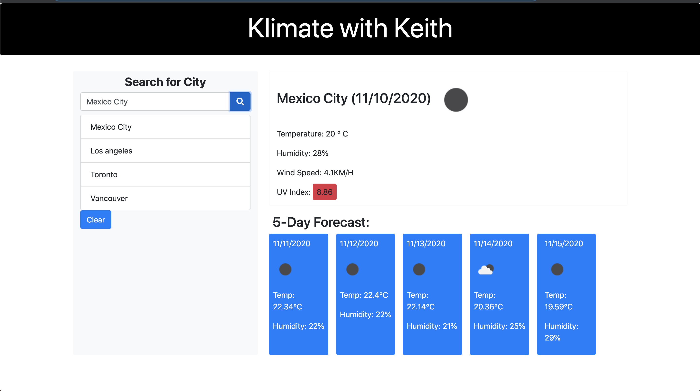

# WeatherDash
Using an API to get and display data

## Server-Side-APIs

Welcome to Klimate with Keith! Where users can find out the weather forecast for multiple cities.
This app displays weather data using the OpenWeatherMap API. 

When users enter a city, the current weather will display. Indicating Temperature in Celsius, Humidity Percentage, Windspeed in KM and a UV index color coded for severity.

Just below is the weather forecast for that city over the next 5 days.

Users' search city will be listed in the column to the side just below the search. When one of those recent cities are clicked, it'll load that city's weather information.

Find the weather in a city using the link below!

**You can find a link to here!** - https://keithyyy.github.io/WeatherDash/

**Here's a screenshot of the weather dash in action:**

